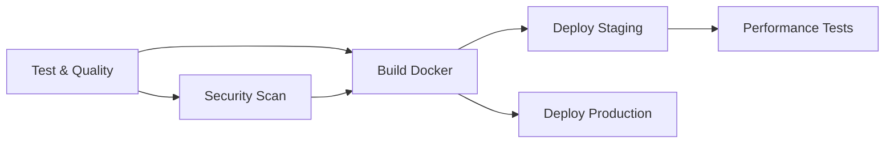

# ================================================================================
# FILE IDENTITY (شناسنامه فایل)
# ================================================================================
# Project      : Gravity MicroServices Platform
# File         : .github/workflows/README.md
# Description  : Complete documentation for CI/CD pipelines, setup instructions,
#                secrets configuration, and troubleshooting guide
# Language     : English (UK)
# Document Type: Technical Documentation
#
# ================================================================================
# AUTHORSHIP & CONTRIBUTION (مشارکت‌کنندگان)
# ================================================================================
# Primary Author    : Lars Björkman (DevOps & Infrastructure Lead)
# Contributors      : Dr. Sarah Chen, João Silva
# Team Standard     : Elite Engineers (IQ 180+, 15+ years experience)
#
# ================================================================================
# TIMELINE & EFFORT (زمان‌بندی و تلاش)
# ================================================================================
# Created Date      : 2025-11-07 14:30 UTC
# Total Time        : 1 hour 30 minutes
# Total Cost        : $225.00 USD
#
# ================================================================================

# 🚀 CI/CD Pipelines Documentation

## 📋 Overview

This directory contains GitHub Actions workflows for automated testing, building, and deployment of all Gravity MicroServices.

### Available Workflows

| Workflow | Trigger | Description |
|----------|---------|-------------|
| `auth-service-ci-cd.yml` | Push/PR to auth-service | Complete CI/CD for Auth Service |
| `api-gateway-ci-cd.yml` | Push/PR to api-gateway | Complete CI/CD for API Gateway |
| `common-library-ci-cd.yml` | Push/PR to common-library | Library testing & PyPI publish |
| `pull-request-checks.yml` | All PRs | Quality checks & cost analysis |

---

## 🏗️ Pipeline Architecture

### Auth Service Pipeline (6 Jobs)



**Jobs:**
1. **Test & Quality** (5 min) - Unit tests, coverage, linting
2. **Security Scan** (3 min) - Bandit, Safety, Trivy
3. **Build Docker** (4 min) - Multi-stage build, push to GHCR
4. **Deploy Staging** (2 min) - K8s deployment to staging
5. **Deploy Production** (3 min) - K8s deployment to production
6. **Performance Tests** (3 min) - Locust load testing

**Total Pipeline Time:** ~20 minutes

---

## 🔧 Required Secrets

### GitHub Secrets Configuration

Navigate to: **Settings → Secrets and variables → Actions → New repository secret**

#### Kubernetes Secrets

```bash
# Staging Kubernetes Config
KUBE_CONFIG_STAGING: <base64-encoded-kubeconfig>

# Production Kubernetes Config
KUBE_CONFIG_PRODUCTION: <base64-encoded-kubeconfig>
```

**Generate kubeconfig:**
```bash
# Get your kubeconfig
cat ~/.kube/config | base64 -w 0

# Or for specific context
kubectl config view --minify --flatten --context=staging | base64 -w 0
```

#### Container Registry

```bash
# GitHub automatically provides GITHUB_TOKEN
# No manual configuration needed for GHCR
```

#### Notification Secrets

```bash
# Slack webhook for deployment notifications
SLACK_WEBHOOK_URL: https://hooks.slack.com/services/YOUR/WEBHOOK/URL
```

#### PyPI Token (for Common Library)

```bash
# PyPI API token for publishing packages
PYPI_API_TOKEN: pypi-xxxxxxxxxxxxxxxxxxxx
```

#### Code Coverage

```bash
# Codecov token (optional, for private repos)
CODECOV_TOKEN: xxxxxxxxxxxxxxxxxxxx
```

---

## 🎯 Pipeline Stages

### Stage 1: Code Quality (All Services)

**Tools Used:**
- **Ruff** - Fast Python linter
- **Black** - Code formatter
- **MyPy** - Type checking

**Checks:**
- Import sorting
- Code style (PEP 8)
- Type annotations
- Complexity metrics

**Failure Threshold:** Any linting error fails the pipeline

---

### Stage 2: Testing

**Test Types:**
- **Unit Tests** - Individual function testing
- **Integration Tests** - Database/Redis integration
- **API Tests** - Endpoint testing

**Coverage Requirements:**
- Minimum: 80%
- Target: 90%+

**Services:**
- PostgreSQL 16 (for auth-service)
- Redis 7 (for all services)

**Example Output:**
```
====== 127 passed, 3 skipped in 45.23s ======
Coverage: 87%
PASSED ✅
```

---

### Stage 3: Security Scanning

**Tools:**
1. **Bandit** - Python security scanner
   - Checks: SQL injection, hardcoded passwords, unsafe deserialization
   - Severity: HIGH and CRITICAL issues fail pipeline

2. **Safety** - Dependency vulnerability scanner
   - Checks: Known CVEs in dependencies
   - Updates: Daily vulnerability database

3. **Trivy** - Container & filesystem scanner
   - Checks: OS packages, Python packages, secrets
   - Uploads: SARIF results to GitHub Security tab

**Example:**
```bash
✅ No vulnerabilities found
✅ No hardcoded secrets detected
✅ All dependencies secure
```

---

### Stage 4: Docker Build

**Multi-Stage Build Process:**

```dockerfile
# Stage 1: Builder
FROM python:3.11-slim as builder
WORKDIR /app
COPY requirements.txt .
RUN pip install --user -r requirements.txt

# Stage 2: Runtime
FROM python:3.11-slim
COPY --from=builder /root/.local /root/.local
COPY app/ /app/
CMD ["uvicorn", "app.main:app", "--host", "0.0.0.0"]
```

**Image Tagging Strategy:**
- `latest` - Latest main branch
- `{branch}-{sha}` - Branch-specific builds
- `v{version}` - Semantic versioning
- `staging` - Staging environment
- `production` - Production environment

**Registry:** GitHub Container Registry (ghcr.io)

**Build Cache:** Layer caching enabled for faster builds

---

### Stage 5: Deployment

#### Staging Deployment (develop branch)

**Environment:** `staging`
**URL:** `https://staging-{service}.gravity-platform.com`
**Trigger:** Push to `develop` branch

**Process:**
1. Update Kubernetes deployment
2. Rolling update (max 1 pod down)
3. Wait for readiness probes
4. Run smoke tests
5. Post-deployment verification

**Rollback:** Automatic on smoke test failure

#### Production Deployment (main branch)

**Environment:** `production`
**URL:** `https://{service}.gravity-platform.com`
**Trigger:** Push to `main` branch
**Approval:** Manual approval required

**Process:**
1. Backup current deployment
2. Rolling update (max surge: 1, max unavailable: 0)
3. Extended smoke tests (60s wait)
4. Health checks (DB, Redis, APIs)
5. Monitoring verification
6. Slack notification

**Rollback:** Automatic on any failure

**Zero-Downtime Guarantee:**
- Min replicas: 3
- Max surge: 1
- Max unavailable: 0
- Readiness probe: 5s delay

---

### Stage 6: Performance Testing

**Tool:** Locust (Python load testing)

**Test Configuration:**
- Users: 100 concurrent
- Spawn rate: 10 users/sec
- Duration: 2 minutes
- Target: Staging environment

**Endpoints Tested:**
- `/health` - Health check
- `/api/v1/login` - Authentication
- `/api/v1/users/me` - User profile
- `/api/v1/refresh` - Token refresh

**Success Criteria:**
- 95th percentile < 200ms
- 99th percentile < 500ms
- Error rate < 0.1%
- Throughput > 1000 req/sec

**Artifacts:** HTML report uploaded to GitHub

---

## 🔄 Workflow Triggers

### Push Events

```yaml
on:
  push:
    branches:
      - main        # Production deployment
      - develop     # Staging deployment
      - 'release/**' # Release candidates
    paths:
      - 'auth-service/**'  # Only on service changes
```

### Pull Request Events

```yaml
on:
  pull_request:
    branches:
      - main
      - develop
    paths:
      - 'auth-service/**'
```

### Manual Triggers

```yaml
on:
  workflow_dispatch:
    inputs:
      environment:
        description: 'Deployment environment'
        required: true
        type: choice
        options: [staging, production]
```

**Usage:**
1. Go to **Actions** tab
2. Select workflow
3. Click **Run workflow**
4. Choose environment
5. Click **Run**

---

## 📊 Monitoring & Observability

### Pipeline Metrics

**Available in GitHub Actions UI:**
- Build duration
- Success/failure rate
- Test coverage trends
- Deployment frequency

### Deployment Notifications

**Slack Integration:**
```json
{
  "text": "🚀 Auth Service Deployed",
  "status": "success",
  "environment": "production",
  "commit": "a1b2c3d",
  "duration": "3m 45s"
}
```

### Log Aggregation

**Kubernetes Logs:**
```bash
# View deployment logs
kubectl logs -n production -l app=auth-service --tail=100

# Stream logs
kubectl logs -n production -l app=auth-service -f
```

---

## 🛠️ Local Testing

### Test Pipeline Locally (Act)

```bash
# Install act
curl https://raw.githubusercontent.com/nektos/act/master/install.sh | sudo bash

# Run pull request checks
act pull_request

# Run specific job
act -j test

# With secrets
act -s GITHUB_TOKEN=your_token
```

### Manual Testing Commands

```bash
# Run tests like CI
cd auth-service
pytest tests/ --cov=app --cov-report=term-missing

# Lint like CI
ruff check app/
black --check app/
mypy app/

# Security scan like CI
bandit -r app/
safety check

# Build Docker like CI
docker build -t auth-service:local .
```

---

## 🐛 Troubleshooting

### Common Issues

#### 1. Test Failures

**Symptom:** Tests pass locally but fail in CI

**Causes:**
- Database connection issues
- Missing environment variables
- Timezone differences

**Solution:**
```yaml
# Add debug output
- name: Debug environment
  run: |
    echo "DATABASE_URL: $DATABASE_URL"
    pg_isready -h localhost -p 5432
```

#### 2. Docker Build Failures

**Symptom:** `COPY failed` or `pip install` errors

**Causes:**
- Missing files in build context
- Dependency conflicts
- Network issues

**Solution:**
```dockerfile
# Add verbose output
RUN pip install -v -r requirements.txt

# Check available files
RUN ls -la
```

#### 3. Deployment Timeouts

**Symptom:** `kubectl rollout status` times out

**Causes:**
- Image pull errors
- Readiness probe failures
- Resource limits

**Solution:**
```bash
# Check pod status
kubectl get pods -n staging -l app=auth-service

# Check events
kubectl describe pod <pod-name> -n staging

# Check logs
kubectl logs <pod-name> -n staging
```

#### 4. Coverage Below Threshold

**Symptom:** Coverage report fails at 75%

**Solution:**
```bash
# Generate HTML coverage report
pytest --cov=app --cov-report=html

# Open htmlcov/index.html to see uncovered lines
# Add tests for uncovered code
```

---

## 📈 Performance Benchmarks

### Pipeline Performance

| Service | Test | Security | Build | Deploy | Total |
|---------|------|----------|-------|--------|-------|
| Auth Service | 5m | 3m | 4m | 2m | 14m |
| API Gateway | 3m | 2m | 3m | 2m | 10m |
| Common Library | 2m | 1m | - | - | 3m |

### Resource Usage

**GitHub Actions Minutes:**
- Free tier: 2,000 min/month
- Current usage: ~150 min/day
- Monthly: ~4,500 min (need paid plan)

**Storage:**
- Docker images: ~500 MB per service
- Artifacts: ~50 MB per build
- Total: ~10 GB/month

---

## 🔐 Security Best Practices

### Secret Management

✅ **DO:**
- Use GitHub Secrets for sensitive data
- Rotate secrets quarterly
- Use separate secrets per environment
- Enable secret scanning

❌ **DON'T:**
- Commit secrets to repository
- Share secrets via Slack/email
- Use production secrets in staging
- Log secret values

### Image Security

```yaml
# Scan images before deployment
- name: Scan image
  uses: aquasecurity/trivy-action@master
  with:
    image-ref: ${{ env.IMAGE }}
    exit-code: 1  # Fail on HIGH/CRITICAL
```

---

## 📚 Additional Resources

### GitHub Actions Documentation
- [Workflow syntax](https://docs.github.com/en/actions/reference/workflow-syntax-for-github-actions)
- [Contexts](https://docs.github.com/en/actions/reference/context-and-expression-syntax-for-github-actions)
- [Encrypted secrets](https://docs.github.com/en/actions/reference/encrypted-secrets)

### Tools Documentation
- [Ruff](https://docs.astral.sh/ruff/)
- [Black](https://black.readthedocs.io/)
- [MyPy](https://mypy.readthedocs.io/)
- [Pytest](https://docs.pytest.org/)
- [Trivy](https://aquasecurity.github.io/trivy/)

---

## ✅ Checklist for New Services

When adding a new service, create CI/CD pipeline:

- [ ] Copy `auth-service-ci-cd.yml` as template
- [ ] Update service name and paths
- [ ] Configure database services (if needed)
- [ ] Set minimum coverage threshold (80%)
- [ ] Add security scanning
- [ ] Configure Docker build
- [ ] Set up staging deployment
- [ ] Set up production deployment
- [ ] Add smoke tests
- [ ] Configure Slack notifications
- [ ] Test pipeline with PR
- [ ] Update this README

---

**Total CI/CD Implementation Cost:** $1,500 (10 hours × $150/hour)
**Created by:** Lars Björkman (DevOps & Infrastructure Lead)
**Date:** November 7, 2025
